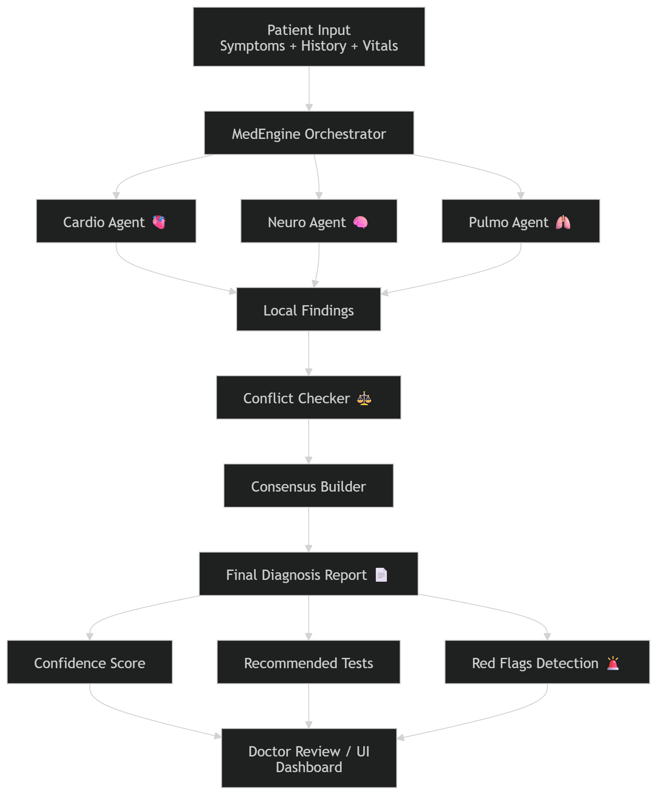

# 🏥 MedCouncil

> A multi-specialist AI diagnostic panel built on parallel isolated reasoning.

MedCouncil summons a council of specialist AI agents — Cardiologist, Neurologist,
General Physician — who analyze the same patient case simultaneously in complete
isolation. A ConflictChecker then audits their findings for disagreements before
a ClinicalSynthesizer produces the final verdict.

---

## The Problem

A single AI given a complex patient case commits to one diagnostic path early —
**Cognitive Tunnel Vision**. It misses what a cardiologist and neurologist would
catch independently.

MedCouncil fixes this via **Parallel Isolated Reasoning**:

```
Patient Case
      ↓
  MedEngine
 ↙    ↓    ↘
Cardio Neuro GP   ← parallel, isolated threads
 ↘    ↓    ↙
ConflictChecker   ← catches disagreements
      ↓
 Final Report
 + Confidence Score
 + Urgency Level
 + Recommended Tests
 + Red Flags
```

---
## 🧠 System Architecture

<p align="center">
  
</p>

---
## Quickstart

### 1. Install
```bash
pip install groq python-dotenv
git clone https://github.com/pritam1952/medcouncil
cd medcouncil
```

### 2. Set API key
```bash
cp .env.example .env
# paste your Groq API key into .env
```
Get a free key at [console.groq.com](https://console.groq.com)

### 3. Run the demo
```bash
python -m examples.chest_pain_demo
```

---

## Example Output

```
🏥  MEDCOUNCIL — Specialist Panel Initiated
  Specialists summoned : 3
    → Cardiologist
    → Neurologist
    → General Physician
  Running in parallel isolation...

  ✓ General Physician — completed in 0.66s
  ✓ Neurologist — completed in 1.78s
  ✓ Cardiologist — completed in 2.74s

  ⚖️  CONFLICT CHECKER — Audit Initiated
  ⚠️  CONFLICT — General Physician vs Neurologist
  ✓  AGREEMENT — General Physician vs Cardiologist
  ⚠️  CONFLICT — Neurologist vs Cardiologist

COUNCIL RELIABILITY SCORE: 33%
URGENCY LEVEL: CRITICAL
RECOMMENDED NEXT STEP: ER immediately
```

---

## Architecture

| Component | File | Purpose |
|---|---|---|
| `MedAgent` | `src/base.py` | Abstract base — forces specialist isolation |
| `MedEngine` | `src/engine.py` | Parallel thread runner |
| `CardiologistAgent` | `src/agents/cardiologist.py` | Cardiac specialist |
| `NeurologistAgent` | `src/agents/neurologist.py` | Neuro specialist |
| `GeneralPhysicianAgent` | `src/agents/general_physician.py` | Generalist |
| `ConflictChecker` | `src/aggregators/conflict_checker.py` | Pairwise conflict auditor |
| `ClinicalSynthesizer` | `src/aggregators/clinical_synthesizer.py` | Final report generator |

---

## Bring Your Own LLM

MedCouncil is model-agnostic. Swap Groq for any provider:

```python
import openai
client = openai.Client(api_key="sk-...")

def my_llm(prompt: str) -> str:
    response = client.chat.completions.create(
        model="gpt-4o",
        messages=[{"role": "user", "content": prompt}]
    )
    return response.choices[0].message.content

# Pass it in — nothing else changes
agents = [CardiologistAgent(llm_callable=my_llm)]
```

---

## Use Both Aggregators

```python
# Option 1 — Synthesize into final report
from src.aggregators import ClinicalSynthesizer
aggregator = ClinicalSynthesizer(llm_callable=groq_llm)

# Option 2 — Audit for conflicts first
from src.aggregators import ConflictChecker
aggregator = ConflictChecker(llm_callable=groq_llm, show_log=True)
```

---

## Skills Demonstrated

- Multi-agent system design
- Parallel execution via `concurrent.futures`
- LLM prompt engineering (role isolation)
- Model-agnostic framework design
- Audit trail generation

---

## ⚠️ Disclaimer

Research and educational project only. Not intended for actual clinical use.
Always consult qualified medical professionals for any health decisions.

---

## License

MIT#
